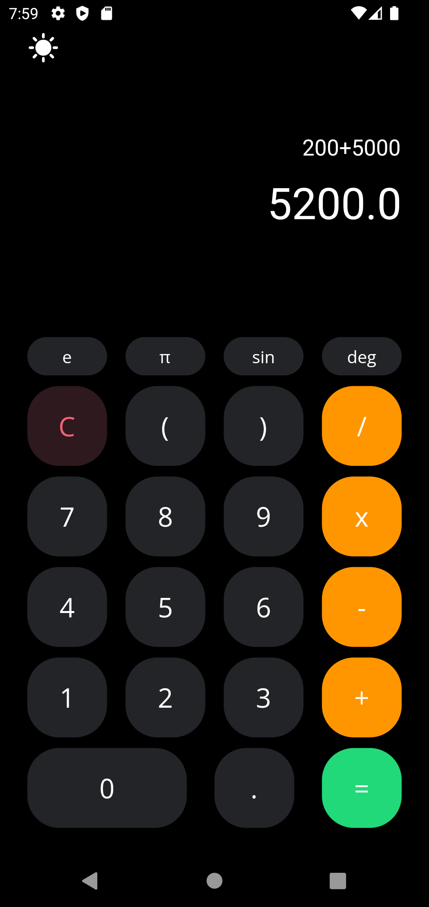

# simple_calculator

  
  

Made with Flutter.

This app is a calculator that performs the basic arithmetic operations.

Dark Mode Support.

Packages used in this project:

- [Provider Package](https://pub.dev/packages/provider)
- [Math Expressions](https://pub.dev/packages/math_expressions)
